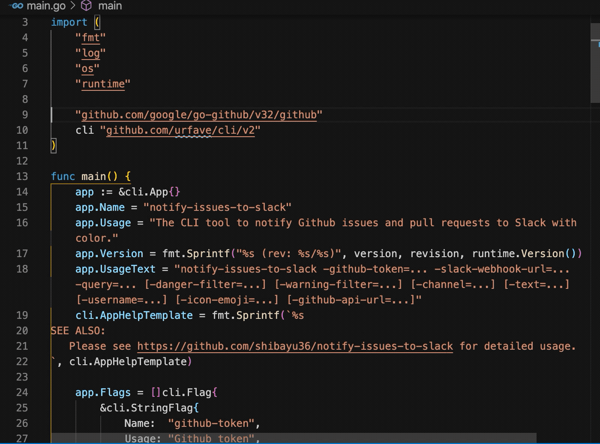

# Find in Current File

A fork of https://github.com/shibayu36/vscode-search-in-current-file with bug fixes.

This is a Visual Studio Code extension that makes it easy to find all in the current active editor.



## How to Use
Install this extension from [marketplace](https://marketplace.visualstudio.com/items?itemName=peterjpxie.find-in-current-file) or build and install by source code.

Open VS code command palette (Ctrl+Shift+P) and type or select 'Find in Current File'.

It will search the selected text (or enter later if no selected text) in the current file displayed in the active editor. 

What it does is just to get the filename in the active editor, open the Search panel, and automatically enter the filename into "files to include" field.

## Default Keyboard Shortcut

```json
{
  "key": "ctrl+alt+c",
  "mac": "cmd+alt+c",
  "command": "find-in-current-file.searchInCurrentFile",
  "when": "editorFocus || editorIsOpen"
}
```

## Build, Test and Publish

Check [RELEASE.md](RELEASE.md)

## Contribution

Issues and PRs are welcomed.
